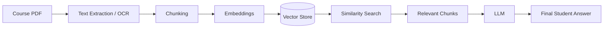

# EDU AI — Blackboard Student Assistant with RAG

EDU AI is a prototype educational assistant that pairs a Blackboard-style student interface with a locally-run Retrieval-Augmented Generation (RAG) pipeline. Student questions about indexed course material are grounded in the actual course PDF content before an LLM generates the final, natural-language answer shown in the chat.

## Project Structure

| File | Role |
|---|---|
| `pro1/pro1.html` | Student-facing chat interface (and faculty dashboard) |
| `pro1/proxy_server.py` | Backend API — routes requests between the frontend, the RAG engine, and the LLM |
| `pro1/rag/ingest.py` | Offline pipeline that processes course PDFs into the vector store |
| `pro1/rag/ocr.py` | Text extraction / OCR for scanned PDF pages |
| `pro1/rag/store.py` | Embeddings, vector store, and similarity search |
| `pro1/requirements.txt` | Python dependencies for the backend and RAG system |

## Running the Project

```bash
cd pro1
pip install -r requirements.txt
export GOOGLE_API_KEY="your-gemini-api-key"
python3 proxy_server.py
```

Then open `http://127.0.0.1:5000/` in a browser. To index a course chapter PDF (or add a new one later), place it in `pro1/rag/knowledge_base/` and run `python3 rag/ingest.py` — already-indexed files are skipped automatically, so new chapters can be added incrementally without rebuilding the whole index.

---

## RAG System Architecture

The system follows a standard retrieval-augmented generation pipeline, running entirely on local, open components except for the final answer-generation call to the LLM:

```
Course PDF → Text Extraction/OCR → Chunking → Embeddings → Vector Store → Similarity Search → Relevant Chunks → LLM → Final Student Answer
```



### Pipeline Stage → Responsible File

| Stage | File | Notes |
|---|---|---|
| Course PDF | `rag/knowledge_base/*.pdf` | Source course material (not tracked as code) |
| Text Extraction / OCR | `rag/ocr.py` | Extracts text from scanned/image-only pages using local OCR (EasyOCR); `rag/ingest.py` uses native PDF text first and only falls back to OCR when a page has no embedded text layer |
| Chunking | `rag/store.py` (`chunk_text`) | Splits extracted text into overlapping, paragraph-aware chunks |
| Embeddings | `rag/store.py` (`embed_text`) | Local sentence-transformers model — no external embedding API |
| Vector Store | `rag/store.py` (`vectors.jsonl`, `manifest.json`) | Flat file store, loaded into memory once at server startup |
| Similarity Search | `rag/store.py` (`search`) | Cosine similarity between the query embedding and stored chunk embeddings |
| Relevant Chunks | `proxy_server.py` (`/api/rag/query`) | Returns the top-k most relevant chunks for a given question |
| LLM | `proxy_server.py` (`/api/chat`) | Sends the question plus retrieved chunks to the Gemini model |
| Final Student Answer | `pro1.html` | Displays only the generated natural-language answer — no raw JSON, chunks, or internal fields are ever shown to the student |

### Question Processing Flow

At runtime, a single student question is processed as follows:

```
Student Question → Query Embedding → Vector Similarity Search → Relevant Chunks → LLM Generation → Final Student Answer
```

1. The student's question is sent to `/api/rag/query`.
2. `rag/store.py` embeds the question with the same local embedding model used at ingestion time.
3. The question embedding is compared against every stored chunk embedding (cosine similarity).
4. The top-k most relevant chunks are returned to the frontend.
5. `pro1.html` attaches those chunks to the tutor's system prompt and calls `/api/chat`.
6. `proxy_server.py` forwards the question and context to the LLM (Gemini) and returns the generated answer.
7. The frontend renders only the final answer text (with math typeset via KaTeX and a short source citation line) — never the underlying JSON, chunks, or retrieval scores.

---

## Conceptual Mapping to ITU-T Y.3172

This section provides a **conceptual mapping** of the EDU AI architecture to the high-level machine learning pipeline component roles described in ITU-T Y.3172. It is intended purely as an architectural reference to help technical reviewers relate this project's design to a recognized ML pipeline vocabulary — it does not describe a literal one-to-one implementation of every Y.3172 component.

> **This is a conceptual mapping to Y.3172, not a claim of ITU-T Y.3172 compliance or certification.** Y.3172 was defined for machine learning in future networks (including IMT-2020); it is used here only as a general vocabulary for describing pipeline roles. No formal conformance to the standard is claimed or implied, and not every Y.3172 role corresponds to a separately implemented component in this codebase (see the Collector and Distributor notes below).

| Y.3172 Role | Conceptual Meaning | EDU AI Implementation |
|---|---|---|
| **SRC** (Source) | Origin of raw data | Course PDF / educational content in `rag/knowledge_base/` |
| **C** (Collector) | Gathers/aggregates data from sources | Not mapped to a separate, standalone component — the project has no independent Collector; PDF files are simply read directly from `rag/knowledge_base/` by the ingestion script (`rag/ingest.py`) |
| **PP** (Pre-processor) | Prepares raw data for the model | OCR and text extraction (`rag/ocr.py`), chunking (`rag/store.py`) |
| **M** (Model) | Performs inference | The embedding model and the LLM (`rag/store.py` for embeddings; the Gemini model called from `proxy_server.py` for answer generation) |
| **P** (Policy) | Governs model behavior and output rules | The system prompts and answer-generation rules defined in `pro1.html` (tutor persona, retrieved-context grounding rules, answer formatting, phase logic) |
| **D** (Distributor) | Moves data between pipeline components | Conceptual mapping only, not a separately implemented Distributor component — `proxy_server.py`'s `/api/rag/query` and `/api/chat` endpoints play this role as part of the backend's normal request handling |
| **SINK** | Consumes the final output | The student interface in `pro1.html`, which receives and displays the final generated answer |

---

## Notes for Reviewers

- All retrieval (OCR, chunking, embeddings, vector search) runs locally with open-source components; only final answer generation calls an external LLM API.
- The vector store and embedding model are loaded once at server startup and kept in memory, not reloaded per request.
- The frontend never displays raw JSON, retrieval scores, or internal pipeline fields — only the final synthesized answer and a short source citation.
